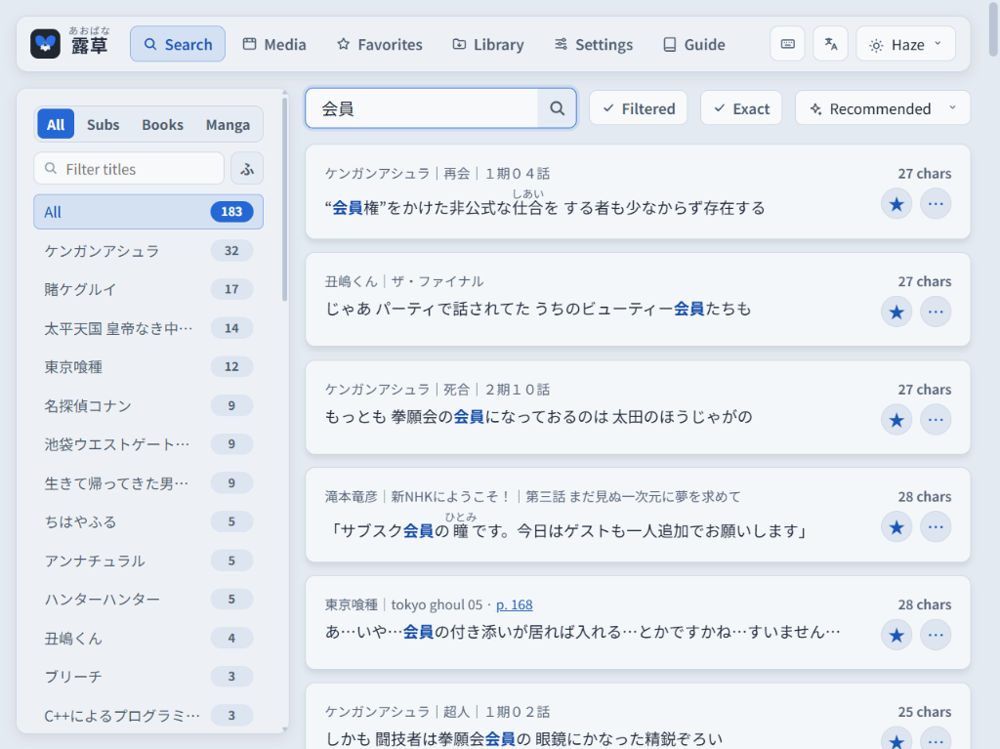
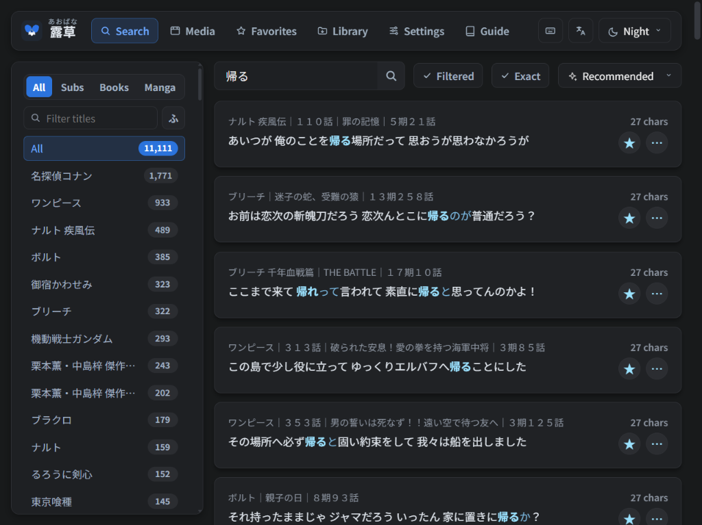
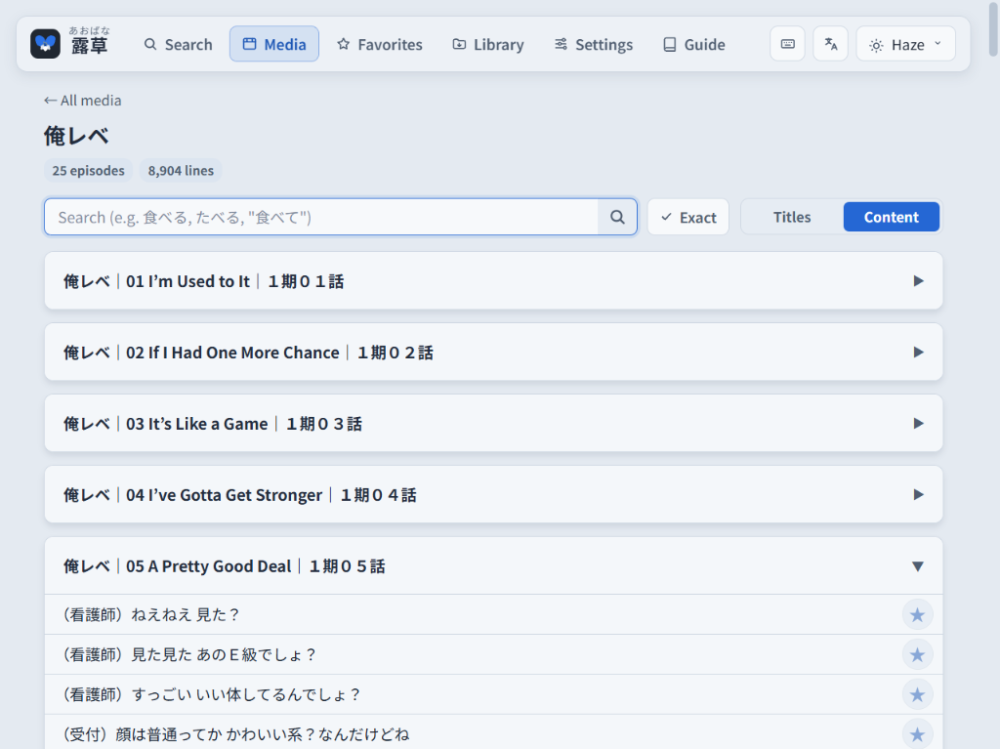

<p align="center">
  
</p>

<h1 align="center">露草 Aobana</h1>

<p align="center"><b>Japanese example sentences from the subtitles, e-books and manga you already own.</b></p>

<p align="center">
  <a href="https://github.com/Wyzmic/Aobana/releases/latest"></a>
  <a href="LICENSE"></a>
</p>

<p align="center">English | <a href="README.ja.md">日本語</a></p>

---

Aobana (露草, *あおばな*) is an offline search engine for Japanese example sentences, built from
the subtitle files, e-books and manga you already own. Everything runs on your own computer and
nothing is sent to the internet: at start it only asks GitHub whether a newer version exists,
and if one does, it offers the release page.



## Features
- **Your own library:** subtitles (`.srt`, `.ass`, `.ssa`), e-books (`.epub`) and manga (`.mokuro`), each indexed from a folder you choose; turn off what you don't use. From an `.ass`, only the Japanese dialogue is read, with its furigana: Chinese and English lines, signs and drawings are left out. A `.mokuro` file is what [mokuro](https://github.com/kha-white/mokuro) writes when it runs OCR on manga pages; Aobana reads its text as mokuro saved it, and the images are not needed.
- **Search that understands Japanese:** `食べる` also finds 食べた and 食べて, and the reading `たべる` works too. Exact matches, and excluding a word with `-`.
- **Furigana:** on every sentence, from the author's own ruby where the book has it. One click turns it off.
- **Context:** open the lines around any sentence, or read a whole episode or chapter in order from the Media tab. **Open folder** shows where a file is on your computer.
- **Favorites, sorting and filters:** save sentences; sort them by recommended, chronological, longest, shortest or random; search one media or all of them, or inside a single title.
- **Japanese and English UI**, four themes, keyboard shortcuts.

## Anki add-on: Aobana Reibun
[Aobana Reibun](https://ankiweb.net/shared/info/1429349152) fills your Anki cards with Japanese example sentences. With Aobana it picks them from your own subtitles, books and manga, with furigana, the title they come from, the lines around them, and for manga the page's image; it also takes sentences with screenshots and audio from Nadeshiko and Immersion Kit. It backfills a whole deck at once, or the card you are reviewing with one hotkey.

To install it, open **Tools → Add-ons** in Anki, press **Get Add-ons...** and enter the code **1429349152**. Its source and guide: [Wyzmic/Aobana-Reibun](https://github.com/Wyzmic/Aobana-Reibun).

## Screenshots
Searching for 帰る across subtitles, books and manga, in the Night theme:



The Media tab, reading an episode in chronological order:



## Install (Windows 10 / 11, 64-bit)
1. Download `Aobana-Setup-<version>.exe` from the [latest release](https://github.com/Wyzmic/Aobana/releases/latest) and run it. It is not code-signed, so Windows SmartScreen may say *"Windows protected your PC"*: click **More info**, then **Run anyway**.
2. Follow the setup. Python and everything else is included, so nothing needs to be installed first, and it works offline.
3. Start **Aobana**. It opens in your browser at `http://127.0.0.1:5000/`, and the first time asks which media you use and where their folders go.

To change your folders later, open the Settings tab.

## Install (macOS, Apple Silicon)
1. Download `Aobana-<version>-macos-arm64.dmg` from the [latest release](https://github.com/Wyzmic/Aobana/releases/latest), open it, and drag **Aobana** into **Applications**.
2. Open Aobana. It is not signed by Apple, so the first time macOS refuses to open it: open **System Settings › Privacy & Security**, scroll down, and click **Open Anyway** next to Aobana. (Or, in Terminal: `xattr -dr com.apple.quarantine /Applications/Aobana.app`.)
3. Aobana starts in a Terminal window and opens in your browser at `http://127.0.0.1:5005/` (not 5000, which macOS's AirPlay Receiver uses). Close the Terminal window to quit.

Your library goes in `Documents/Aobana/Subtitles`, `Documents/Aobana/Books` and `Documents/Aobana/Manga` unless you choose other folders at the first start, and the databases and settings in `~/Library/Application Support/Aobana`. You can change the folders in the Settings tab. Intel Macs: run from source.

## Install (Linux, x86-64)
Two downloads on the [latest release](https://github.com/Wyzmic/Aobana/releases/latest), the same app in each. They are built and tested automatically (Ubuntu 22.04 and 24.04, Fedora), but not yet confirmed at a real Linux desktop: if something does not work, please [open an issue](https://github.com/Wyzmic/Aobana/issues).
- **`Aobana-<version>-linux-x86_64.tar.gz`** (recommended): unpack it and run `./install.sh` in the unpacked folder. That adds **Aobana** to your applications menu and an `aobana` command. Run the new version's `install.sh` to update, and `~/.local/share/aobana-app/uninstall.sh` to remove it.
- **`Aobana-<version>-x86_64.AppImage`**: one file, nothing installed. Make it executable (`chmod +x`) and run it. If it says FUSE is missing, run it with `--appimage-extract-and-run`.

Aobana runs in a terminal window; close the window to quit. Your library goes in `~/Documents/Aobana/Subtitles`, `~/Documents/Aobana/Books` and `~/Documents/Aobana/Manga` unless you choose other folders at the first start, and the databases and settings in `~/.local/share/aobana`.

## Usage
1. **Add files.** Give each show its own folder inside the subtitles folder: the folder's name becomes the show's name. A subtitle file placed directly in the subtitles folder is read as a show of its own, named after the file. Books can go anywhere in the books folder. Give each manga series its own folder inside the manga folder, one `.mokuro` file per volume.
   ```
   Subtitles folder/
   ├─ Show A/
   │   ├─ Show A S01E01.srt
   │   └─ Show A S01E02.srt
   └─ Show B/
       └─ Season 1/
           └─ Show B 第01話.srt

   Books folder/
   └─ [Author] Title.epub

   Manga folder/
   └─ Series A/
       ├─ Series A 01.mokuro
       └─ Series A 02.mokuro
   ```
2. **Build the index.** Press **Index library** in the Library tab (all media, or only one of them). Before a run that adds files, Aobana estimates how large the index will get and how long it will take, and warns when the databases would pass 10 GB. Later runs only process files that changed.
   **Check library**, in the same tab, finds subtitles and books that are not in Japanese and duplicates (another rip of the same episode, a set of SubPlz outputs, the same book in two files). The files you tick are only left out of the index: nothing is moved or deleted, and you can put them back. Bilingual subtitles are indexed with their Japanese part only.
3. **Search.**

The Guide tab explains the rest. Aobana runs in a small console window; close it to quit.

## Android (Termux)
Aobana runs on an Android phone and opens in your browser there, so a pop-up dictionary such as Yomitan works on it in Firefox. It needs about 1.5 GB free, and Termux and Termux:Widget from the same store, Google Play or [F-Droid](https://f-droid.org/packages/com.termux/): builds from different stores cannot work together.

1. **Install** — paste this into Termux, and allow storage access when asked:
   ```bash
   curl -fsSL https://raw.githubusercontent.com/Wyzmic/Aobana/main/termux/install.sh | bash
   ```
   It sets up a small Ubuntu inside Termux (the Sudachi analyzer has no Android build), installs Python and the pinned packages there, puts the files Aobana runs from (nothing else) in `/storage/emulated/0/Aobana`, and adds an **Aobana** shortcut for the Termux:Widget widget. Run the same command again to update; from 1.1 on, when a new version is out, the page offers **Update now**, which does that for you and reloads.
2. **Add your library** to that folder: copy `subs.db`, `epub.db` and `manga.db` into its `data/db` folder from a computer where Aobana has indexed it (fastest, and identical results), or put files in `content/Subtitles` and `content/Books` there (`content/Manga` once Manga is on in the Settings tab) and press **Index library** in the Library tab (slow on a phone).
3. **Start** — add the Termux:Widget widget to your home screen and tap **Aobana**. The page opens in Firefox if it is installed, otherwise in your default browser. If no browser opens, allow Termux *Display over other apps* in Android's settings. Closing Termux stops Aobana.

**Uninstall** — removes Aobana's Ubuntu, the shortcut and the app's files; in the Aobana folder only your databases, media and settings stay, for you to delete if you no longer want them:
```bash
curl -fsSL https://raw.githubusercontent.com/Wyzmic/Aobana/main/termux/uninstall.sh | bash
```

## Run from source (Windows, macOS, Linux)
Python 3.14 is what the release is built and tested with.
```bash
git clone https://github.com/Wyzmic/Aobana.git
cd aobana
pip install -r requirements.txt
python -m aobana
```
From a source folder, the media folders are `content/Subtitles`, `content/Books` and `content/Manga` in the cloned folder, and the databases and settings go in `data/`. You can point the folders elsewhere from the Settings tab. The pins in `requirements.txt` matter: the Sudachi dictionary decides how every sentence is indexed, so do not upgrade it on its own.

To build the Windows installer yourself, see `release/build.py`; the macOS and Linux downloads are built by `release/build_unix.py`, which the GitHub workflow runs.

## Extra ruby data
`data/ruby/ruby.tsv` holds a few tab-separated tables that help Aobana draw furigana over the right characters, such as words whose ruby covers the whole word, readings a book gives in parentheses that a dictionary confirms, and the readings of furigana in `.ass` subtitles. Sudachi's dictionary does not cover these words yet, so without the tables their furigana would be drawn over the wrong characters. The tables are the developer's effort to make furigana more accurate.

## Suggestions and bug reports
Ideas for what to add are welcome, and so are reports of anything that looks wrong. Open an
[issue](https://github.com/Wyzmic/Aobana/issues) for either.

## Acknowledgements
- [Nadeshiko](https://github.com/BrigadaSOS/Nadeshiko), whose sentence search inspired many of these features.
- [Sudachi](https://github.com/WorksApplications/sudachi.rs) and its dictionary, for the morphological analysis.
- [Noto Sans JP](https://fonts.google.com/noto/specimen/Noto+Sans+JP), the bundled font.

Third-party licenses are listed in [THIRD_PARTY_NOTICES.md](THIRD_PARTY_NOTICES.md).

## Copyright
- Aobana includes no subtitles and no books. It indexes files on your own computer; use it only with files you have the right to use.
- The screenshots quote a few short lines from the developer's own library to show how the app works. The titles shown belong to their rights holders.
- If you hold the rights to something shown and want it removed, [open an issue](https://github.com/Wyzmic/Aobana/issues) and the image will be replaced.
- Aobana collects nothing and sends nothing: it runs only on your computer.

## License
[GPL-3.0](LICENSE)
